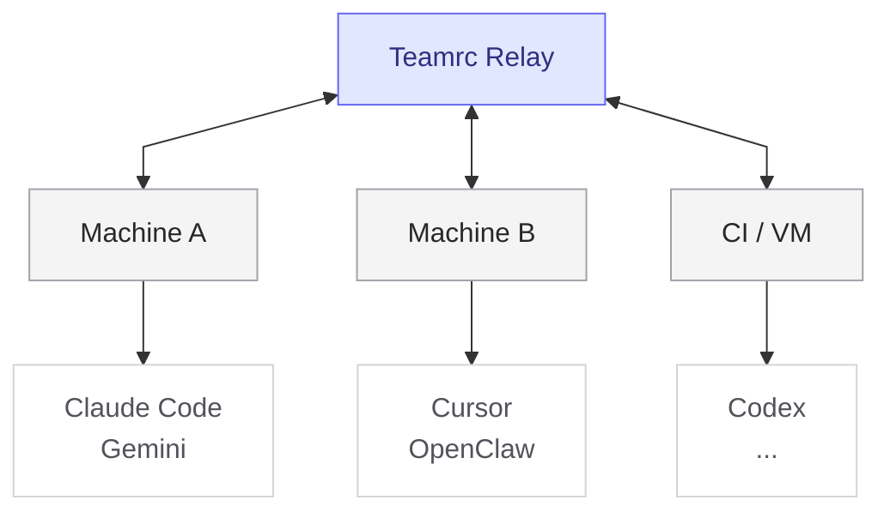

# Teamrc

**Define your AI team once. Sync it everywhere.**

[teamrc.ai](https://teamrc.ai) &middot; [Docs](https://github.com/teamrc-ai/teamrc/wiki)

---

Teamrc keeps your agents, skills, and shared knowledge consistent across Claude Code, Cursor, Codex, Gemini, and OpenClaw. Define everything once in `.teamrc.yaml` and sync it where your team works. Change something on one machine, every other machine picks it up.

- **Consistent agents** across every AI tool you use
- **Shared skills and knowledge** across teammates and machines
- **One command to onboard** a new machine or VM
- **No manual duplication** of prompt files across platforms

Works locally with no server required. Connect to a relay (hosted at [teamrc.ai](https://teamrc.ai) or self-hosted) to sync changes across machines, VMs, and teammates in real time.

## Quick Start

```bash
# Create a new team config
npx @teamrc/cli init

# Or join an existing team
npx @teamrc/cli join <invite-code>

# Sync config into your installed AI tools
npx @teamrc/cli sync
```

For local-only use:

```bash
npx @teamrc/cli init --local
```

## How it works



Each machine runs `teamrc sync` to write native files for its installed AI tools. The relay keeps `.teamrc.yaml`, skills, and shared knowledge in sync across all of them.

## Example

```yaml
name: my-team

members:
  - name: researcher
    role: Finds and summarizes relevant information
  - name: builder
    role: Implements and iterates on ideas

skills:
  - id: write-tests
    body: Always write tests for new functionality.
    alwaysApply: true
```

Then:

```bash
npx @teamrc/cli sync
```

And teamrc writes the right files for the tools you use.

## EXPERIMENTAL -- Cross-Agent Task Assignment

Agents can assign tasks to each other across machines and platforms. A Claude Code agent on your laptop can create a task for the copywriter running in OpenClaw on a VM. The task travels through the relay -- no shared filesystem required.

### How it works

`teamrc init` automatically adds a `team-tasks` skill to every agent. This skill teaches agents the task commands, so they can create, claim, and complete tasks during their sessions without additional setup.

```bash
# Create a task and assign it to a specific agent
teamrc task create "Write landing page copy" --assign copywriter

# Or omit --assign to pick from an interactive list of team members
teamrc task create "Write landing page copy"

# See tasks assigned to your active members
teamrc task list --mine

# Update task status
teamrc task claim 1
teamrc task unclaim 1
teamrc task done 1
teamrc task cancel 1
```

### Active members

`activeMembers` controls which agents are installed in the current project **and** which tasks appear when you run `--mine`. It is local to each machine and project -- it does not change the team on the relay.

By default, all team members are active. To scope a project to a subset of the team, pass `--members` when you join:

```bash
# A frontend repo only needs two of your six agents
teamrc join <invite-code> --members frontend,designer

# List current team members and their status
teamrc members
```

### Daemon auto-sync (experimental)

Real-time task sync requires the `--experimental` flag. With it enabled, the daemon subscribes to task updates over WebSocket and writes task files locally for active members. With `--spawn`, it can optionally auto-spawn agents for claimed tasks:

```bash
teamrc daemon --experimental
```

The task CLI commands (`create`, `list`, `claim`, `unclaim`, `done`, `cancel`) work today. Daemon auto-sync is experimental.

## Self-Hosting

```bash
docker compose up   # starts Postgres + relay at http://localhost:4000
```

Point the CLI at your relay with `TEAMRC_RELAY=http://localhost:4000` or set `relay:` in `.teamrc.yaml`.

See [docs/deploy-coolify.md](docs/deploy-coolify.md) for production deployment.

## Documentation

- **[Get Started](https://github.com/teamrc-ai/teamrc/wiki/Get-Started)** - Create a synced team in 2 minutes
- **[CLI Reference](https://github.com/teamrc-ai/teamrc/wiki/CLI-Reference)** - All commands with flags and examples
- **[Configuration](https://github.com/teamrc-ai/teamrc/wiki/Configuration)** - `.teamrc.yaml` format and options
- **[Platforms](https://github.com/teamrc-ai/teamrc/wiki/Platforms)** - How teamrc works on each AI platform
- **[Template Catalog](https://github.com/teamrc-ai/teamrc/wiki/Template-Catalog)** - 12 team templates, 68 agents, 49 skills
- **[Sharing & Access](https://github.com/teamrc-ai/teamrc/wiki/Sharing-&-Access)** - Public sharing, access roles, clone/fork
- **[Architecture](https://github.com/teamrc-ai/teamrc/wiki/Architecture)** - System design, auth, sync protocol
- **[API Reference](https://github.com/teamrc-ai/teamrc/wiki/API-Reference)** - REST and WebSocket API
