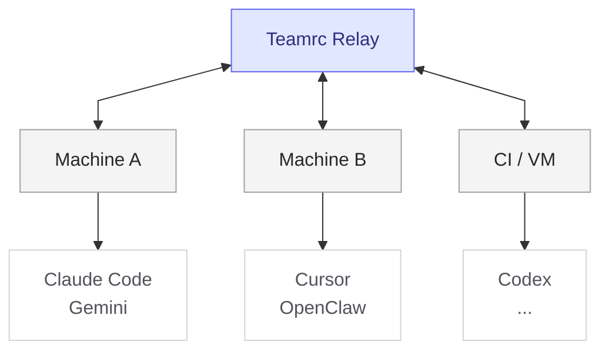

# Teamrc

**Define your AI team once. Sync it everywhere.**

[teamrc.ai](https://teamrc.ai) &middot; [Docs](https://github.com/teamrc-ai/teamrc/wiki)

---

If you keep recreating the same agents, skills, and prompts across Claude Code, Cursor, Codex, Gemini, OpenClaw, and different machines, teamrc gives you one source of truth.

Define your setup once in `.teamrc.yaml`, then run `teamrc sync` to write the native files your installed AI tools expect.

- **One shared definition** for agents, skills, and team knowledge
- **Local-first**: no server required for solo use
- **Optional relay sync** for multi-machine and team workflows
- **Native output** for Claude Code, Cursor, Codex, Gemini, and OpenClaw

## Why teamrc

Without teamrc, your AI setup drifts fast:

- Claude has one setup
- another tool has a different one
- your VM is missing prompts or agents
- a new machine means manual copy/paste
- teammates never quite share the same setup

Teamrc keeps one source of truth in `.teamrc.yaml` and writes the native config files each tool expects.

## Quick start

### Option A: local-only

Use this if you want one setup across your own tools and machines, without using a relay.

```bash
npx @teamrc/cli init --local
npx @teamrc/cli sync
```

### Option B: shared / multi-machine

Use this if you want to join an existing team or sync through a relay.

```bash
npx @teamrc/cli join <invite-code>
npx @teamrc/cli sync
```

After `sync`, teamrc writes native agent, skill, and config files for the supported AI tools installed on this machine.

## Which command do I want?

- `init` — create a new team here
- `init --local` — try teamrc without any server or account
- `push` — connect a local team to a relay later
- `join <invite-code>` — join an existing synced team
- `clone <token>` — copy a public/read-only team as a starting point
- `sync` — write the current team config into the AI tools installed on this machine

## Example: define once, install everywhere

```yaml
name: my-team

members:
  - name: researcher
    role: Finds and summarizes relevant information
  - name: builder
    role: Implements and iterates on ideas

skills:
  - id: write-tests
    body: Always write tests for new functionality.
    alwaysApply: true
```

Then:

```bash
npx @teamrc/cli sync
```

What happens next:

- supported tools get native agent/config files for `researcher` and `builder`
- always-on skills are written in each platform’s native format
- the same setup can be applied on another machine with the same workflow

## Supported platforms

Teamrc currently supports:

- Claude Code
- Cursor
- Codex
- Gemini
- OpenClaw

Platform scope differs by tool. See [Platforms](https://github.com/teamrc-ai/teamrc/wiki/Platforms) for the exact file locations, project/global behavior, and platform-specific notes.

## Local-first by default

You do not need a server or account to use teamrc locally.

Start with a local-only team:

```bash
npx @teamrc/cli init --local
```

If you later want shared state across machines or teammates, you can connect to a relay:

- hosted: `https://teamrc.ai`
- self-hosted: your own relay

## How it works



Each machine runs `teamrc sync` to write native files for its installed AI tools. If you connect a relay, team config and shared knowledge can stay in sync across machines and teammates.

## Active members

`activeMembers` controls which agents are installed in the current project. It is local to each machine and project — it does not change the team on the relay.

By default, all team members are active. During `init` and `join`, an interactive chooser lets you pick which agents should be active on this machine. You can also pass `--members` explicitly:

```bash
# Interactive: prompts you to select active agents
teamrc init
teamrc join <invite-code>

# Explicit: skip the picker
teamrc join <invite-code> --members frontend,designer
teamrc init --members frontend,designer

# Change active members later
teamrc members
```

## Self-hosting

Need team-wide sync under your own control?

```bash
docker compose up   # starts Postgres + relay at http://localhost:4000
```

Point the CLI at your relay with `TEAMRC_RELAY=http://localhost:4000` or set `relay:` in `.teamrc.yaml`.

See [docs/deploy-coolify.md](docs/deploy-coolify.md) for production deployment.

## Documentation

### Start here
- **[Get Started](https://github.com/teamrc-ai/teamrc/wiki/Get-Started)** - Create a synced team in 2 minutes
- **[Platforms](https://github.com/teamrc-ai/teamrc/wiki/Platforms)** - How teamrc works on each AI platform
- **[Configuration](https://github.com/teamrc-ai/teamrc/wiki/Configuration)** - `.teamrc.yaml` format and options

### Operate it
- **[CLI Reference](https://github.com/teamrc-ai/teamrc/wiki/CLI-Reference)** - All commands with flags and examples
- **[Sharing & Access](https://github.com/teamrc-ai/teamrc/wiki/Sharing-&-Access)** - Public sharing, access roles, clone/fork
- **[Template Catalog](https://github.com/teamrc-ai/teamrc/wiki/Template-Catalog)** - 12 team templates, 68 agents, 49 skills

### Run / extend it
- **[Architecture](https://github.com/teamrc-ai/teamrc/wiki/Architecture)** - System design, auth, sync protocol
- **[API Reference](https://github.com/teamrc-ai/teamrc/wiki/API-Reference)** - REST and WebSocket API
