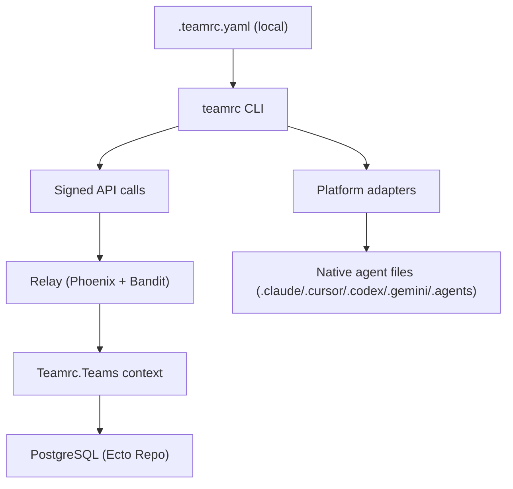

# teamrc Architecture

**Last updated:** 2026-03-13

## Overview

teamrc has two primary runtimes:

1. **CLI** (`cli/`) running on developer machines
2. **Relay** (`teamrc/`) as an Elixir/Phoenix service backed by PostgreSQL

The local `.teamrc.yaml` file is the canonical team definition on each machine. The relay is an optional shared source that enables collaboration and distribution across machines. Teams can also run fully local without a relay connection.

## Main Components

### CLI (`cli/`)

- Reads and writes `.teamrc.yaml`
- Applies teams to platform-native files via adapters
- Signs API requests with Ed25519 (`x-trc-signature`, `x-trc-timestamp`)
- Polls for updates in daemon mode (every 120s by default)
- Works offline for local teams (`init --local`, `apply`, `import`, `status`)

Primary files:
- `cli/src/index.ts`
- `cli/src/client.ts`
- `cli/src/daemon.ts`
- `cli/src/adapters/*`

### Relay (`teamrc/`)

- Phoenix router and controllers for API and web traffic
- LiveView UI for team management and onboarding
- Ecto/Postgrex for persistence
- In-memory GenServer for device auth (ephemeral state only)

Primary files:
- `teamrc/lib/teamrc_web/router.ex`
- `teamrc/lib/teamrc_web/controllers/*`
- `teamrc/lib/teamrc_web/live/*`
- `teamrc/lib/teamrc/teams.ex`
- `teamrc/lib/teamrc/device_auth.ex`

## Request Flows

### `teamrc push`

1. CLI reads local `.teamrc.yaml` and knowledge
2. CLI sends signed `POST /api/teams`
3. Relay validates signature and request limits
4. `ApiController.create_team` calls `Teams.put_team/3`
5. Relay writes current team state to Postgres (`teams`, `members`, `token_teams`)

### `teamrc sync`

1. Performs the same push path (`POST /api/teams`)
2. Pulls latest relay state with signed `GET /api/teams/:token` (optional `team_id`)
3. CLI updates local `.teamrc.yaml`
4. CLI applies resulting state to platform adapters
5. CLI merges knowledge append-only with dedup

### `teamrc clone` → `teamrc init` (fork flow)

1. `clone` fetches team definition via `GET /api/teams/clone/:clone_token`
2. CLI writes `.teamrc.yaml` with `cloneToken` but no `teamId`
3. Cloned teams support read-only `pull` (via `cloneByToken`), but `sync`/`push` are blocked (`requireTeamContext` requires `teamId`)
4. User runs `init` in the same directory
5. `init` detects existing `.teamrc.yaml` without `teamId`, adopts it
6. Strips `cloneToken`, sanitizes content (`sanitizeTeamDefinition`)
7. Creates a new independent team on relay via `POST /api/teams` (new `teamId`)
8. Sets `client.setTeamId()` so subsequent calls (knowledge push, invite) target the correct team
9. Proceeds with normal init flow: knowledge, ownership, invites
10. All future `pull`/`push`/`sync` operate on the new team  --  no connection to the original
11. If the user declines the relay prompt (or uses `--local`), the team is created locally without a relay connection. Running `teamrc push` later will register it on the relay.

### Local-only teams

Teams created with `teamrc init --local` or via declining the relay prompt during interactive init have no `teamId` or `relay` fields in `.teamrc.yaml`. They support:

- `apply`  --  regenerate platform files from YAML
- `import`  --  import platform config into YAML
- `status`  --  show team state (sync status shows "local-only")
- `delete`  --  remove all teamrc files
- `add-member`, `list-templates`, `list-agents`, `whoami`, `doctor`

Commands that require relay (`sync`, `pull`, `diff`, `export`, `invite`, `share`, `claim`, `dashboard`, `daemon`) show: "This team is local-only. Run `teamrc push` to connect."

### Connecting a local team (`teamrc push`)

When `push` detects a team with no `teamId`, it runs a "connect" flow:

1. CLI creates a new `TeamrcClient` with the machine's keypair
2. Calls `POST /api/teams` to register the team on the relay
3. Receives `teamId` and `owner_claim_secret`
4. Updates `.teamrc.yaml` with `teamId` and `relay` fields
5. Pushes knowledge if it exists
6. Offers ownership claim and invite generation
7. All relay-dependent commands now work

### `teamrc diff`

- The diff is computed in the CLI, not stored server-side.
- The CLI compares the local adapter-read team against the relay `GET /api/teams/:token` payload.

## Authentication and Authorization

### Signed API auth (most API paths)

- Ed25519 signatures verified by the `VerifySignature` plug
- The token format embeds the public key: `trc_ak_<base64url(pubkey)>`
- Timestamp drift window is 5 minutes
- The signed message includes the timestamp and the raw request body (or `GET /path?query` for GET requests)

### Optional Clerk auth (account APIs and dashboard)

- `VerifyClerkJWT` protects account endpoints
- The reassociation endpoint requires both a Clerk JWT and a signature

## Runtime State and Concurrency Model

### `Teamrc.Teams` Context Module

- Plain Ecto context module with no GenServer and no in-memory state
- All operations (CRUD, invites, authorization) query Postgres directly in the caller's process
- Authorization checks (token-to-team_id mapping) use the `token_teams` table
- Fully concurrent. Each Phoenix endpoint process runs its own queries independently.

### `Teamrc.DeviceAuth` GenServer

- Holds ephemeral device auth requests in memory
- 15-minute TTL
- Periodic sweep every 60 seconds
- Capacity limits:
  - max 3 active requests per token
  - max 10,000 active requests globally

### ETS-backed rate limiter

- Per-IP and per-token counters
- Default 60 req/min token limit in API pipelines
- Periodic cleanup every 5 minutes

## Persistence Model (PostgreSQL)

Core tables:

- `teams`
  - Team definition metadata, JSONB skills/platforms, and optional knowledge
  - Visibility (`public` or `private`) and optional `clone_token`
- `members`
  - Team members, linked by `team_id`
- `invites`
  - Invite code and expiry, linked by `team_id`
- `token_teams`
  - Membership relation between a machine token and a team
- `accounts`
  - Clerk user mapping
- `account_tokens`
  - Machine tokens linked to accounts, with revocation metadata

Notable constraints and indexes:

- unique invite codes
- unique `(token, team_id)` membership
- unique account clerk user id
- unique account token
- unique clone token when present

## API Surface (Current)

Signed API:

- `POST /api/teams`
- `GET /api/teams/:token`
- `GET /api/teams/all/:token`
- `POST /api/join`
- `POST /api/teams/preview`
- `POST /api/teams/invite`
- `POST /api/auth/device`
- `GET /api/auth/device/:device_code`

Public API:

- `GET /api/teams/clone/:clone_token`

Clerk API:

- `GET /api/account`
- `GET /api/account/teams`
- `DELETE /api/account/machines/:token`

Clerk + Signature API:

- `POST /api/account/reassociate`

## Deployment Model

### Local development

- `docker-compose` starts Postgres 16 and the relay app container
- The relay runs migrations at startup through the release entrypoint

### Production

- Mix release in multi-stage Docker image
- Configured at runtime via environment variables:
  - `DATABASE_URL`
  - `POOL_SIZE` (default `10`)
  - Phoenix and session salts and secrets
  - Optional Clerk JWKS/issuer/audience

## Architectural Tradeoffs

1. **Stateless team operations.** The Teams context is a plain Ecto module. Fully concurrent, with no serialization bottleneck.
2. **GenServer only for ephemeral state.** DeviceAuth uses a GenServer for short-lived auth requests (15-min TTL). This fits because the state is transient and does not need persistence.
3. **No revision history.** The relay stores current state, not versioned diffs.
4. **CLI-driven merge semantics.** Knowledge merge and diff logic lives in the CLI for deterministic local behavior.
5. **Local-first by default.** Teams work fully offline. The relay is opt-in at init time and can be connected later via `push`. This makes `init` non-blocking for users who just want local agent management.

## Future Evolution

1. Add an optional revision table (`team_revisions`) if server-side history or audit logging is needed.
2. Introduce ETag or revision-based pull checks to reduce unnecessary daemon poll payloads.
