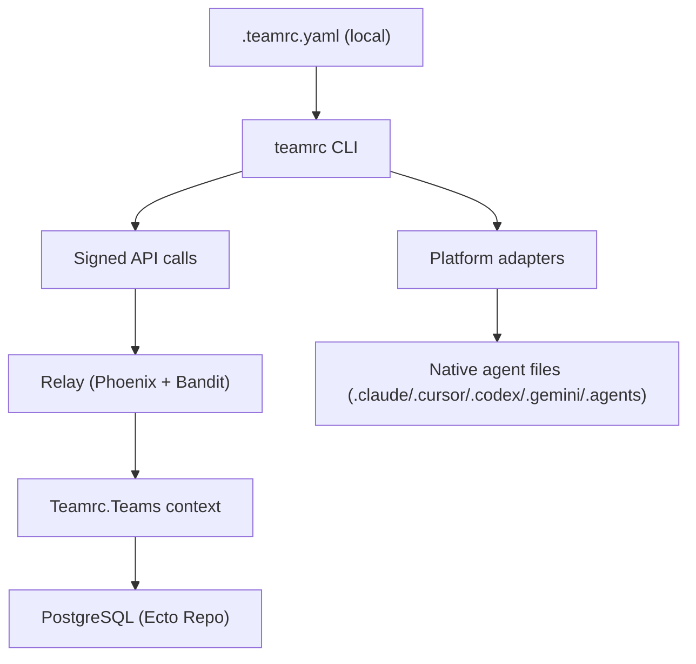

# teamrc Architecture

**Last updated:** 2026-03-10

## Overview

teamrc has two primary runtimes:

1. **CLI** (`cli/`) running on developer machines
2. **Relay** (`teamrc/`) as an Elixir/Phoenix service backed by PostgreSQL

The local `.teamrc.yaml` file is the canonical team definition on each machine. The relay is the shared cross-machine source used for collaboration and distribution.

## Main Components

### CLI (`cli/`)

- Reads/writes `.teamrc.yaml`
- Applies teams to platform-native files via adapters
- Performs signed API requests (`x-trc-signature`, `x-trc-timestamp`)
- Runs background polling in daemon mode (default every 120s)

Primary files:
- `cli/src/index.ts`
- `cli/src/client.ts`
- `cli/src/daemon.ts`
- `cli/src/adapters/*`

### Relay (`teamrc/`)

- Phoenix router + controllers for API and web traffic
- LiveView UI for team management and onboarding
- Ecto/Postgrex for persistence
- In-memory GenServer for device auth flow (ephemeral state)

Primary files:
- `teamrc/lib/teamrc_web/router.ex`
- `teamrc/lib/teamrc_web/controllers/*`
- `teamrc/lib/teamrc_web/live/*`
- `teamrc/lib/teamrc/teams.ex`
- `teamrc/lib/teamrc/device_auth.ex`

## Request Flows

### `teamrc push`

1. CLI reads local `.teamrc.yaml` and knowledge
2. CLI sends signed `POST /api/teams`
3. Relay validates signature and request limits
4. `ApiController.create_team` calls `Teams.put_team/3`
5. Relay writes current team state to Postgres (`teams`, `members`, `token_teams`)

### `teamrc sync`

1. Performs the same push path (`POST /api/teams`)
2. Pulls latest relay state with signed `GET /api/teams/:token` (optional `team_id`)
3. CLI updates local `.teamrc.yaml`
4. CLI applies resulting state to platform adapters
5. CLI merges knowledge append-only with dedup

### `teamrc diff`

- Diff is computed in CLI, not stored server-side.
- CLI compares local adapter-read team vs relay `GET /api/teams/:token` payload.

## Authentication and Authorization

### Signed API auth (default API paths)

- Uses Ed25519 signatures via `VerifySignature` plug
- Token format embeds public key (`trc_ak_<base64url(pubkey)>`)
- Timestamp drift window is 5 minutes
- Signed message includes timestamp and raw request body (or `GET /path?query`)

### Optional Clerk auth (account APIs and dashboard)

- `VerifyClerkJWT` protects account endpoints
- Optional dual-auth endpoint requires both Clerk JWT and signature for reassociation

## Runtime State and Concurrency Model

### `Teamrc.Teams` Context Module

- Plain Ecto context module — no GenServer, no in-memory state
- All operations (CRUD, invites, authorization) query Postgres directly in the caller's process
- Authorization checks (token → team_id mapping) use the `token_teams` table
- Full concurrency — each Phoenix endpoint process runs its own queries independently

### `Teamrc.DeviceAuth` GenServer

- Holds ephemeral device auth requests in memory
- 15-minute TTL
- Periodic sweep every 60 seconds
- Capacity limits:
  - max 3 active requests per token
  - max 10,000 active requests globally

### ETS-backed rate limiter

- Per-IP and per-token counters
- Default 60 req/min token limit in API pipelines
- Periodic cleanup every 5 minutes

## Persistence Model (PostgreSQL)

Core tables:

- `teams`
  - team definition metadata + JSONB skills/platforms + optional knowledge
  - visibility (`public`/`private`) and optional `clone_token`
- `members`
  - team members linked by `team_id`
- `invites`
  - invite code + expiry linked by `team_id`
- `token_teams`
  - membership relation between machine token and team
- `accounts`
  - Clerk user mapping
- `account_tokens`
  - machine tokens linked to accounts, with revocation metadata

Notable constraints/indexes:

- unique invite codes
- unique `(token, team_id)` membership
- unique account clerk user id
- unique account token
- unique clone token when present

## API Surface (Current)

Signed API:

- `POST /api/teams`
- `GET /api/teams/:token`
- `GET /api/teams/all/:token`
- `POST /api/join`
- `POST /api/teams/preview`
- `POST /api/teams/invite`
- `POST /api/auth/device`
- `GET /api/auth/device/:device_code`

Public API:

- `GET /api/teams/clone/:clone_token`

Clerk API:

- `GET /api/account`
- `GET /api/account/teams`
- `DELETE /api/account/machines/:token`

Clerk + Signature API:

- `POST /api/account/reassociate`

## Deployment Model

### Local development

- `docker-compose` starts:
  - Postgres 16
  - Relay app container
- Relay runs migrations at startup through release entrypoint

### Production

- Mix release in multi-stage Docker image
- Runtime configuration via environment variables:
  - `DATABASE_URL`
  - `POOL_SIZE` (default `10`)
  - Phoenix/session salts and secrets
  - optional Clerk JWKS/issuer/audience

## Architectural Tradeoffs

1. **Stateless team operations:** Teams context is a plain Ecto module — fully concurrent, no serialization bottleneck.
2. **GenServer only for ephemeral state:** DeviceAuth uses GenServer for short-lived auth requests (15-min TTL). This is appropriate since the state is transient and doesn't need persistence.
3. **No revision history:** relay stores current state, not versioned diffs.
4. **CLI-driven merge semantics:** knowledge merge/diff logic lives in CLI for deterministic local behavior.

## Future Evolution (Suggested)

1. Add optional revision table (`team_revisions`) if server-side history/audit is needed.
2. Introduce ETag/revision-based pull checks to reduce unnecessary daemon poll payload.
